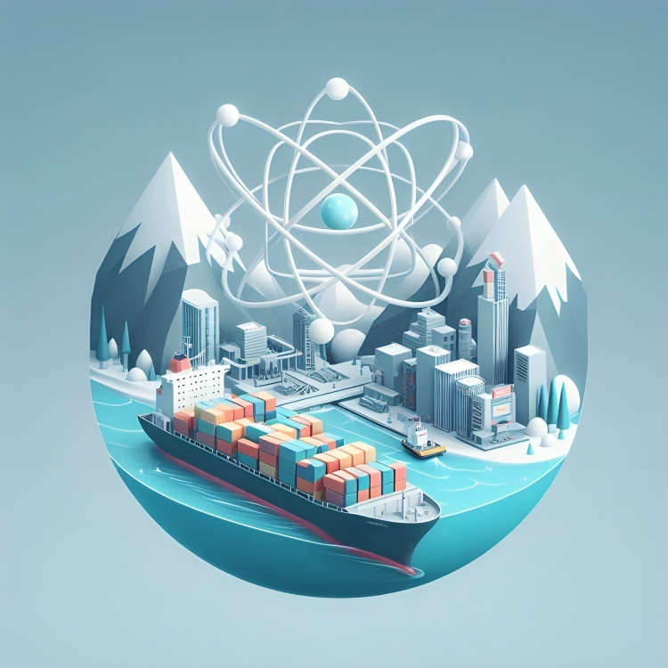

<h1 id="top" align="center">SendSphere <br/> Micro Frontend Service</h1> 

<br>

<div align="center">
    
</div>

## 🔍 Table of Contents

- [About Project](#intro)
- [Technologies](#technologies)
- [Software Versions](#software-versions)
- [Features](#features)
- [Releases](#releases)
- [System Startup](#system-startup)
  - [Developer Mode](#developer-mode)
  - [Production Mode](#production-mode)
- [Contributors](#contributors)
 
<br/>

<h2 id="intro">📌 About Project</h2> 

The React UI Interface project offers an interactive front-end, containerized with Docker for easy deployment and consistent performance across environments.

<br/>

<h2 id="technologies">☄️ Technologies</h2>

### DevOps

&nbsp; [](https://www.docker.com/)

### Web Server

&nbsp; [](https://www.nginx.com/)

### Frontend

&nbsp; [](https://react.dev/)

&nbsp; [](https://redux.js.org/)

&nbsp; [](https://mui.com/material-ui/)

&nbsp; [](https://www.typescriptlang.org/)

&nbsp; [](https://axios-http.com/)

&nbsp; [](https://vitejs.dev/)

&nbsp; [](https://eslint.org/)

&nbsp; 

&nbsp; [](https://www.ibm.com/docs/bg/aix/7.2?topic=files-env-file)

&nbsp; 

&nbsp; [](https://nodejs.org)

&nbsp; [](https://www.npmjs.com/)

<br/>

<h2 id="software-versions">🏷️ Software Versions</h2>

| Software     | Version    |
|--------------|------------|
| NodeJS       | 22.11.0    |
| npm          | 10.8.3     |

<br/>

<h2 id="features">🔥 Features</h2>

+ **Custom Modal:** Includes a custom modal component with configurable actions to enhance user interaction.
+ **Global State Management:** Redux implementation for consistent state handling across the application.
+ **Persistent Data:** Language, theme mode, and theme schema are stored in localStorage.
+ **Internationalization:** Language support with i18n for a multilingual user experience.
+ **Custom Scrollbar Design:** Custom scrollbar styling to match the application's aesthetic.
+ **Floating Action Button:** A "Go to Top" button for improved navigation.
+ **Multi-Message Snackbar:** Support for displaying multiple snackbars using notistack.
+ **Professional UI/UX:** Modern user interface and experience.
+ **Input Validation:** Enhanced validation support for user inputs.
+ **Dark/Light Theme Mode:** Toggle between dark and light modes.
+ **Theme Schema Customization:** Toggle between default and custom theme schema.
+ **Custom Theme:** Added support for custom themes.
+ **Responsive Design:** Optimized for different screen sizes and devices.
+ **Material-UI Integration:** Extensive use of Material-UI components.
+ **Environment Variables:** Support for environment variables to manage configurations.
+ **Dockerization:** The application is containerized for consistent deployment and scaling.

<br/>

<h2 id="releases">🚢 Releases</h2> 

&nbsp; [](https://github.com/ahmettoguz/Micro-Frontend/tree/release/2.3.1)

&nbsp; [](https://github.com/ahmettoguz/Micro-Frontend/tree/release/2.3.0)

&nbsp; [](https://github.com/ahmettoguz/Micro-Frontend/tree/release/2.2.0)

&nbsp; [](https://github.com/ahmettoguz/Micro-Frontend/tree/release/2.1.0)

&nbsp; [](https://github.com/ahmettoguz/Micro-Frontend/tree/release/2.0.0)

&nbsp; [](https://github.com/ahmettoguz/Micro-Frontend/tree/release/1.0.0)

<br/>

<h2 id="system-startup">🚀 System Startup</h2> 

<h3 id="developer-mode">🧪 Developer Mode</h3>

#### Using command line

```
npm i
npm run dev
```

<br/>

<h3 id="production-mode">⚡Production Mode</h3> 

* Follow the instructions in the [`Micro-Docker-Config repository`](https://github.com/ahmettoguz/Micro-Docker-Config) to configure Docker for production.

<br/>

<h2 id="contributors">👥 Contributors</h2> 

<a href="https://github.com/ahmettoguz" target="_blank"></a> 

[🔝](#top)
